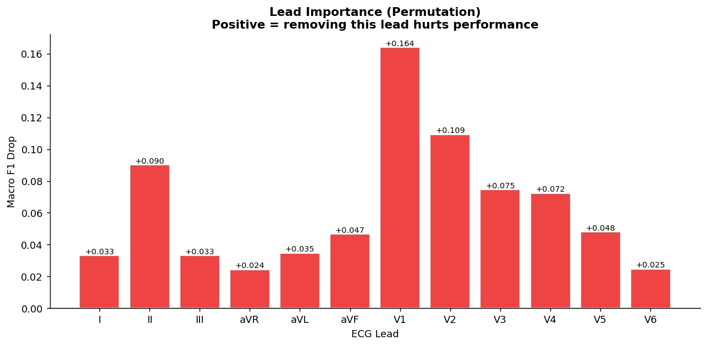

# ECG-Risk-Stratification
ECG-based cardiovascular risk stratification using deep learning on PTB-XL


# ECG-Based Cardiovascular Risk Stratification Using Deep Learning


> Stratifying patients into **Low / Medium / High** cardiovascular risk from raw 12-lead ECG signals using deep learning on the PTB-XL dataset.


---

## 📌 Overview

Most ECG classifiers treat this as a binary or rhythm-detection problem. This project frames it as **clinical risk stratification** — directly useful for triage prioritization in resource-constrained settings.

**Prediction task:** Multiclass classification → Low / Medium / High cardiovascular risk  
**Dataset:** [PTB-XL](https://physionet.org/content/ptb-xl/) — 21,837 12-lead ECGs, 100/500 Hz  
**Architecture:** CNN-Transformer hybrid (1D CNN feature extractor + Transformer encoder)

---

## 🏷️ Label Mapping

| Risk Class | SCP-ECG Codes | Clinical Meaning |
|------------|---------------|-----------------|
| Low | NORM, SR | No significant abnormality |
| Medium | IRBBB, LAD, mild ST changes, early AFIB | Warrants monitoring |
| High | MI variants, LBBB, RBBB, ischemia, VT/VF | Requires urgent evaluation |

> Multi-label records: assigned the **highest** risk label (conservative clinical default).

---

## ⚙️ Setup

```bash
git clone https://github.com/YOUR_USERNAME/ecg-risk-stratification.git
cd ecg-risk-stratification
pip install -r requirements.txt
```

**Download PTB-XL:**
```bash
# Requires a free PhysioNet account
wget -r -N -c -np https://physionet.org/files/ptb-xl/1.0.3/ -P data/ptbxl/
```

> Data is excluded from version control via `.gitignore`. ~2.5 GB download.


---


## 📊 Results

| Model | Macro F1 | High-Risk Recall | Accuracy |
|-------|----------|-----------------|---------|
| Logistic Regression (baseline) | — | — | — |
| 1D ResNet-34 | 0.6577 | 0.7312 | 68.76% |
| CNN-Transformer | 0.6424 | 0.7591 | 66.81% |

> **Clinical note:** CNN-Transformer is preferred for triage despite lower macro F1 — it catches more high-risk patients (recall 0.7591 vs 0.7312), minimizing dangerous false negatives.

---
## 🔍 Interpretability

**Lead Importance** — V1, V2, V3 and Lead II are the most critical leads,
consistent with clinical knowledge (anterior MI detection, rhythm assessment).




---

## 📦 Requirements

```
torch>=2.0
wfdb
neurokit2
scikit-learn
numpy
pandas
matplotlib
seaborn
wandb
```

---

